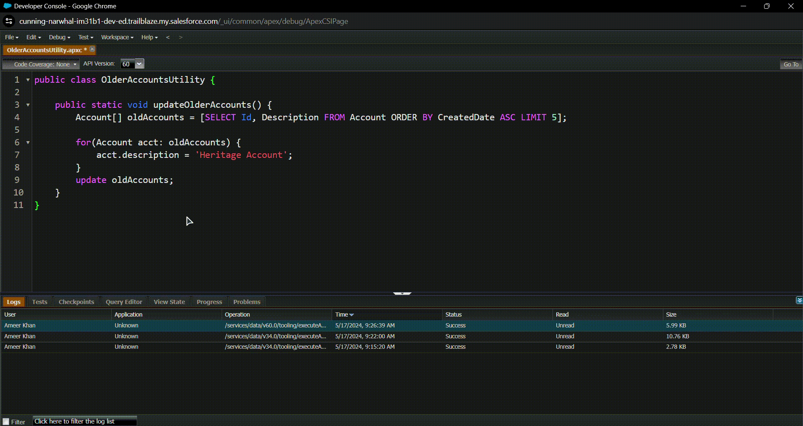

# 📍 Apex Triggers

<div align="center">

</div>

## ⭐ Apex 

Apex is a strongly-typed, object-oriented programming language that Salesforce.com uses to execute flow and transaction control statements on the Salesforce platform. Apex enables developers to add business logic to most system events, including button clicks, related record updates, and Visualforce pages. It is designed to run in a multitenant environment, meaning the code executes in the context of the Salesforce server, and it can access and manipulate data from the Salesforce database.

### ⚡ Key Features of Apex

1. **Object-Oriented**: Supports classes, interfaces, inheritance, and polymorphism.

2. **Data-Focused**: Closely integrated with the database and can perform DML operations (like insert, update, delete).

3. **Strongly Typed**: Variables must be declared with a specific data type.

4. **Multitenant**: Designed to be executed in a shared environment with stringent governor limits to ensure no single tenant monopolizes shared resources.

5. **Hosted**: Code executes on Salesforce servers.

---

### ⚡ Create an Apex Class

To create an Apex class in Salesforce, follow these steps:

1. **Log in to Salesforce**: Go to your Salesforce instance and log in with your credentials.
   
2. **Navigate to the Developer Console**:
   - Click on your profile picture or avatar in the top right corner.
   - Select "Developer Console" from the dropdown menu.

3. **Create a New Apex Class**:
   - In the Developer Console, go to `File > New > Apex Class`.
   - Enter a name for your class (e.g., `OlderAccountsUtility`).

```apex
public class OlderAccountsUtility {

}
```

### ⚡ Add a Method to the Class


Creating methods in an Apex class involves defining the method's signature, which includes the access modifier, return type, method name, and parameters (if any)

#### 💻 Define a Method

Define the method within the class body. A method can include several components:

1. **Access Modifier**: Specifies the visibility (e.g., `public`, `private`, `protected`, `global`).

2. **Return Type**: Specifies the type of value the method returns (e.g., `void`, `String`, `Integer`, `List<Account>`).

3. **Method Name**: The name of the method (should follow naming conventions).

4. **Parameters**: Optional input parameters the method accepts.


```apxc
public class MyApexClass {

    // A simple method that returns a greeting message
    public String getGreeting(String name) {
        return 'Hello, ' + name + '!';
    }

    // A method that adds two integers and returns the result
    public Integer addNumbers(Integer num1, Integer num2) {
        return num1 + num2;
    }

    // A method that updates the name of an Account record
    public void updateAccountName(Id accountId, String newName) {
        Account acc = [SELECT Id, Name FROM Account WHERE Id = :accountId LIMIT 1];
        acc.Name = newName;
        update acc;
    }

    // A method that returns a list of Account names
    public List<String> getAllAccountNames() {
        List<Account> accounts = [SELECT Name FROM Account];
        List<String> accountNames = new List<String>();
        for (Account acc : accounts) {
            accountNames.add(acc.Name);
        }
        return accountNames;
    }

    // A private method for internal calculations (not accessible outside this class)
    private Decimal calculateDiscount(Decimal amount, Decimal discountRate) {
        return amount * (1 - discountRate);
    }
}
```

--- 

#### 💻 Code from Trailmix 

```apxc
public class OlderAccountsUtility {

    public static void updateOlderAccounts() {
        Account[] oldAccounts = [SELECT Id, Description FROM Account ORDER BY CreatedDate ASC LIMIT 5];
        
        for(Account acct: oldAccounts) {
            acct.description = 'Heritage Account';
        }
        update oldAccounts;
    }
}
```

#### 💻 Execution of code



---

# 📍 Apex Basics & Database